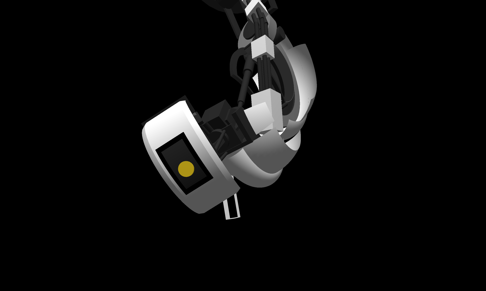

# Computer Graphics Assignment 1

A 3D scene built with pyglet, displaying a hierarchical GLaDOS model from Portal 2, with animation that recreates the "wake up" sequence.



## How to Run

### Using Makefile

```bash
make run
make clean
```

### Manual setup

```bash
python3 -m venv .venv
.venv/bin/pip install -r requirements.txt
.venv/bin/python main.py
```

Press `SPACE` to run animation!

## Controls

### Camera

| Key | Action |
|-----|--------|
| `W` / `S` | Move forward / backward (along look direction) |
| `A` / `D` | Strafe left / right (horizontal plane) |
| `Q` / `E` | Move up / down (world Y axis) |
| Left-drag mouse | Yaw / pitch the camera |
| Scroll wheel | Dolly along forward direction |
| `R` | Reset camera to starting pose |
| `ESC` | Quit |

### Animation Playback

| Key | Action |
|-----|--------|
| `SPACE` | Toggle animation play / pause |
| `[` / `]` | Scrub to previous / next keyframe (pauses playback) |
| `G` | Toggle debug axes |
| `Z` | Restarts the program (to pick up code edits) |

### Joint Poser

A tool for posing joints and building keyframes.

| Key | Action |
|-----|--------|
| `1`-`9` | Select joint by index |
| `j` / `k` | Cycle parameter within selected joint (down / up) |
| `h` / `l` | Decrement / increment active parameter |
| `Shift+H` / `Shift+L` | Coarse adjustment |
| `P` | Print all joint params to stdout and copy to clipboard (`wl-copy` is used if wayland is used) |

## Implementation

### Scene Graph & Hierarchical Transforms

The scene graph (`scene.py`) is a tree of `Node` objects, each with a local transform (Mat4) relative to its parent. Every frame, world transforms propagate top-down: `node._world = parent._world @ node.local_transform`.

**Joint** is a `Node` subclass whose `local_transform` is computed from animatable parameters via an ordered list of **steps**:

- **FixedStep(mat)**: constant Mat4 (e.g., a fixed offset or orientation)
- **RotStep(axis, index)**: rotation by `params[index]` radians around `axis`
- **TransStep(index)**: translation by `Vec3(params[i], params[i+1], params[i+2])`

Steps compose left-to-right, allowing animated transforms to be sandwiched between fixed ones (e.g., `FIXED @ ROT @ TRANS @ FIXED`).

### Primitives

All primitives (`primitives.py`) provide vertices, per-vertex normals, indices, and colors. Partial angular sweeps and hollow interiors are supported.

| Primitive | Description |
|-----------|-------------|
| **Cube** | Cube |
| **Ellipsoid** | Parametric ellipsoid with theta/phi range cuts |
| **Torus** | Major/minor radius with major/minor angular range cuts |
| **Frustum** | Truncated cone with inner radius (hollow), theta range cuts |
| **Axes** | XYZ axes with ticks |

Primitives are double-sided so they render correctly with backface culling enabled.

### Gouraud Shading

Two shared shader programs (`shader.py`):

1. **Lit (Gouraud)**: per-vertex ambient + Lambert diffuse with point light attenuation.
   Lighting is computed in the vertex shader and interpolated across faces.
   - Attenuation: `1 / (c + l*d + q*d^2)` where `d` is the light-to-vertex distance
   - No specular component
   - Light parameters: position `(5, 8, 5)`, white color, ambient `0.35`, linear attenuation `0.02`

2. **Unlit (passthrough)**: vertex colors passed through directly. Used for Axes and debug gizmos.

Both programs share a single `view_proj` uniform updated once per frame. Per-shape `model` matrices are set via CustomGroup.

### Keyframe Animation System

The animation system (`animate.py`) drives joint parameters over time:

- **Keyframe**: a timestamp + dict mapping joint names to parameter lists.
- **Timeline**: sorted keyframes with `sample(t)` that finds the surrounding pair and interpolates using the destination keyframe's easing function.
- **AnimationPlayer**: advances elapsed time, writes sampled params to joints, optionally drives a separate camera timeline and syncs audio playback.

#### Easing Functions

Each keyframe specifies an easing curve for the interpolation *arriving* at it:

| Name | Formula | Character |
|------|---------|-----------|
| `linear` | `t` | Constant velocity |
| `smooth` | `3t^2 - 2t^3` (Hermite smoothstep) | Smooth start and stop (default) |
| `back_out` | `1 + (t-1)^2 * ((s+1)(t-1) + s)`, s=1.70158 | Cubic overshoot |

#### Camera Animation

An independent `cam_timeline` interpolates `_cam_eye` and `_cam_target` keys separately from the model keyframes.

#### Audio Sync

The player loads an MP3 file via pyglet's streaming media and maintains sync:
- Playback starts at a configurable offset (`audio_start`) into the audio file
- Pause/play/scrub operations keep audio aligned with the animation elapsed time

### GLaDOS Model

The model (`models.py`) is a hand-built hierarchical assembly of ~60 nodes with 9 animated joints:

- `ceil_disc`: body rotation
- `ceil_drum`: Y-axis translation (raising/lowering)
- `joint_ceil_drum`: body swing
- `joint_center1`, `joint_center2`: torso articulation
- `joint_neck`: neck twist
- `joint_head`: 3-DOF head (pitch, roll, yaw)
- `joint_eye_core`: eye aim + pop-out translation
- `joint_eye_iris`: iris aim + pop-out translation

The "wake up" animation is a 56-second sequence of 37 keyframes with a synchronized camera path and audio from the game.

## File Structure

```
assign1/
  Makefile
  requirements.txt
  main.py               Entry point
  render.py             Camera, projection, lighting, draw loop
  shader.py             GLSL vertex/fragment shader sources
  control.py            Keyboard/mouse input handling
  scene.py              Node, Joint, Scene graph, transform propagation
  animate.py            Keyframe, Timeline, AnimationPlayer, easing functions
  primitives.py         Cube, Ellipsoid, Torus, Frustum, Axes
  model/
    glados.py           GLaDOS model builder + wake-up animation keyframes
  audio/
    glados_wakes_up.mp3 GLaDOS wake-up animation audio track
  assets/               Screenshots
```

## References

- Point light attenuation coefficients: [LearnOpenGL - Light Casters](https://learnopengl.com/Lighting/Light-casters)
- Smoothstep: Ken Perlin's Hermite interpolation, `3t^2 - 2t^3`
- pyglet documentation: [pyglet.org](https://pyglet.org/)

