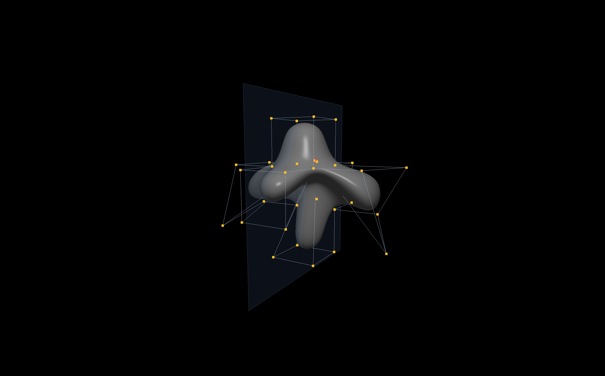

# PA2 — Surfaces & Subdivision



## Build & Run

```
make            # default: bezier on 4x4 grid
make bspline    # uniform cubic B-spline on 4x4 grid
make cube       # Catmull-Clark on cross-cube
make ico        # Catmull-Clark on icosahedron
```

Requires Python 3.10+ and pyglet 2.x. `make` creates a venv and installs
dependencies automatically.

## Controls

| Key | Action |
|-----|--------|
| LMB drag point | move control point |
| LMB drag background | orbit |
| RMB / MMB drag | pan |
| scroll | zoom |
| S / Shift+S | CC subdivide +/- level |
| E | save cage + surface |
| Shift+E | save versioned snapshot |
| Z / Shift+Z | undo / redo |
| M | toggle X-mirror editing |
| C | toggle cage visibility |
| V | toggle surface sample dots |
| F / Shift+F | frame scene / frame selected point |
| h/j/k/l/n/, | nudge cage (x/y/z) |
| ESC | quit |

## Implementation notes

### Bezier and B-spline surfaces

Both are evaluated as bicubic patches tiled over the control net. Bezier
patches step by 3 (adjacent patches share boundary CPs); B-spline patches
step by 1. Normals are computed analytically from the cross product of
partial derivatives. The order of the cross product matters for correct
outward orientation — `cross(dS/dv, dS/du)` for our parametrization.

During mouse drag, tessellation drops to 8 steps (from 24) for
responsiveness, then rebuilds at full resolution on release.

### Catmull-Clark subdivision

N-gon native. No pre-triangulation — quads and tris both feed CC directly,
and one step always produces all-quad output. Boundary vertices use the
DeRose rule: `(6P + n1 + n2) / 8`.

Normals are computed by averaging face normals per vertex after
fan-triangulation.

CC level is capped at 1 during drag for the same performance reason as
spline surfaces.

### Phong shading

Per-fragment lighting with a single point light and distance attenuation
`1/(a + b*d + c*d^2)`. Material properties (k_a, k_d, k_s, shininess) are
per-group uniforms so different parts can have different materials.

### Mirror editing

Pairs are computed once at load time by matching vertices across x=0.
When mirror mode is on, moving a point also moves its partner with negated
x-delta. Points on the mirror plane are clamped to x=0.

### Rendering quirks

Topology changes (CC level change followed by cage edit) cause pyglet 2.1.x
to render stale vertex positions from the old vlist. Workaround:
`replace_mesh_vlist` deletes and recreates the vlist on the same group,
keeping the shader program alive.

## Artistic model — EVE (from WALL-E)

Seven parts, each modeled as a separate cage:

| Part | Surface type | Notes |
|------|-------------|-------|
| head | Catmull-Clark | egg shape, CC-subdivided cube |
| body | Catmull-Clark | taller egg |
| visor | Bezier | 4x4 patch in XY plane |
| arm_l | Catmull-Clark | thin paddle |
| arm_r | mirror of arm_l | generated by mirror_obj.py |
| eye_l | Catmull-Clark | small oval |
| eye_r | mirror of eye_l | generated by mirror_obj.py |

Workflow: edit each part with `make eve-head`, `make eve-body`, etc.
The `--ref` flag loads other parts as dim static meshes for alignment.
`make eve-compose` mirrors L parts to R and merges everything into one obj.
`make eve-view` renders the composite with per-part materials (glossy white
shell, black visor, blue eyes).

## Exported .obj files

All under `model/`:

```
model/grid.obj                        demo Bezier/B-spline 4x4 cage
model/grid_bezier_surface.obj         Bezier surface from grid
model/grid_bspline_surface.obj        B-spline surface from grid
model/cross_cube.obj                  demo CC cage (plus-cube)
model/cross_cube_surface.obj          CC surface from cross-cube
model/icosahedron.obj                 demo CC cage (icosahedron)
model/icosahedron_surface.obj         CC surface from icosahedron
model/art/head.obj                    head cage (CC)
model/art/head_surface.obj            head surface
model/art/body.obj                    body cage (CC)
model/art/body_surface.obj            body surface
model/art/visor.obj                   visor cage (Bezier)
model/art/visor_surface.obj           visor surface
model/art/arm_l.obj                   left arm cage (CC)
model/art/arm_l_surface.obj           left arm surface
model/art/arm_r_surface.obj           right arm (X-mirrored)
model/art/eye_l.obj                   left eye cage (CC)
model/art/eye_l_surface.obj           left eye surface
model/art/eye_r_surface.obj           right eye (X-mirrored)
model/art/eve.obj                     final composite
```

