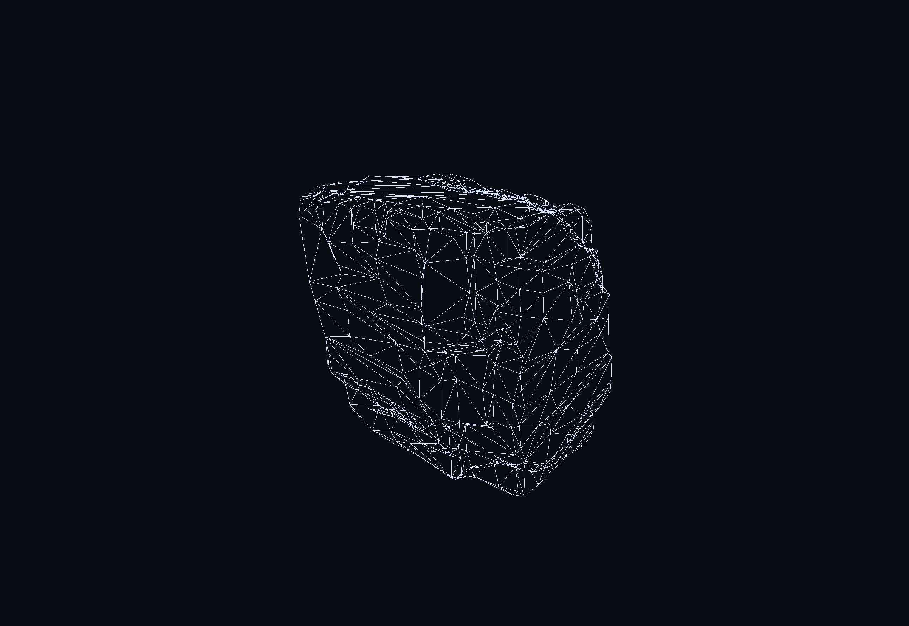
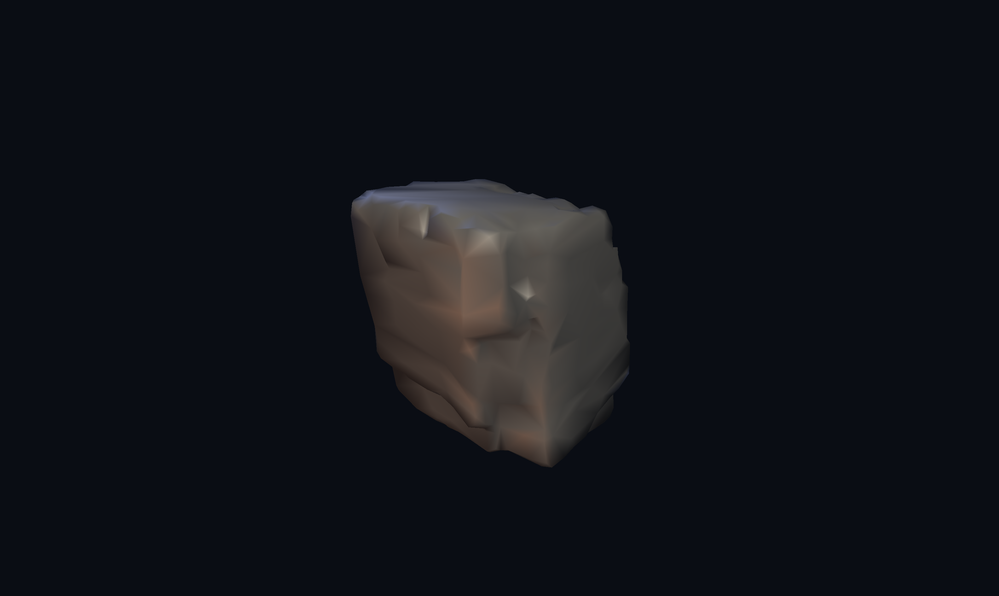
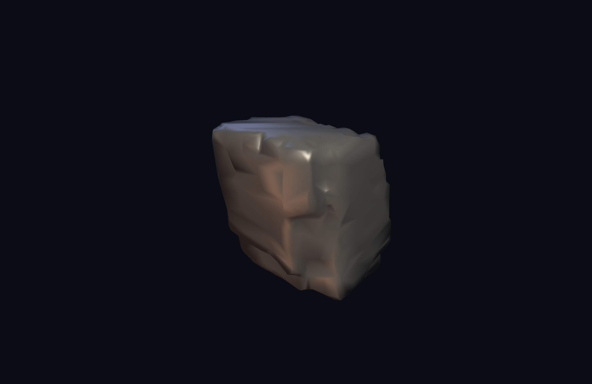
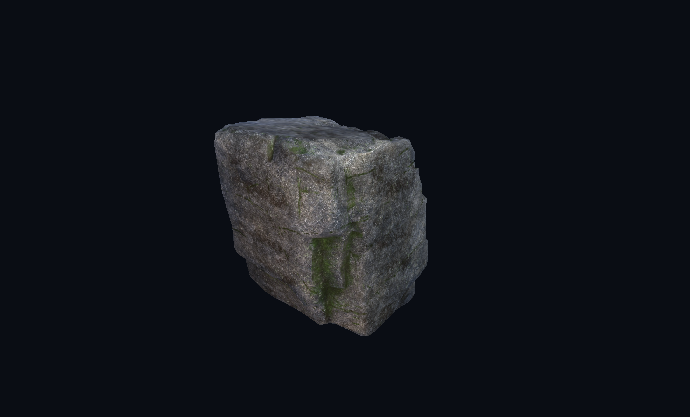
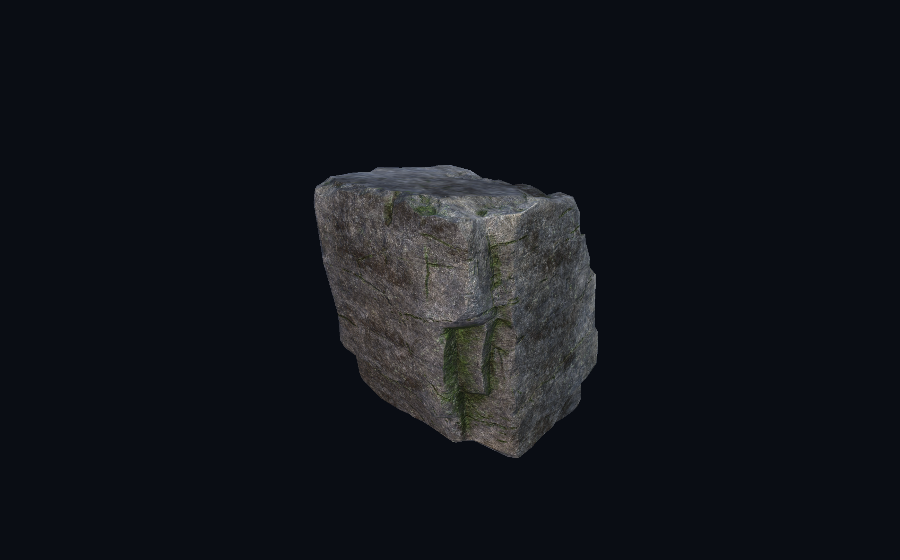
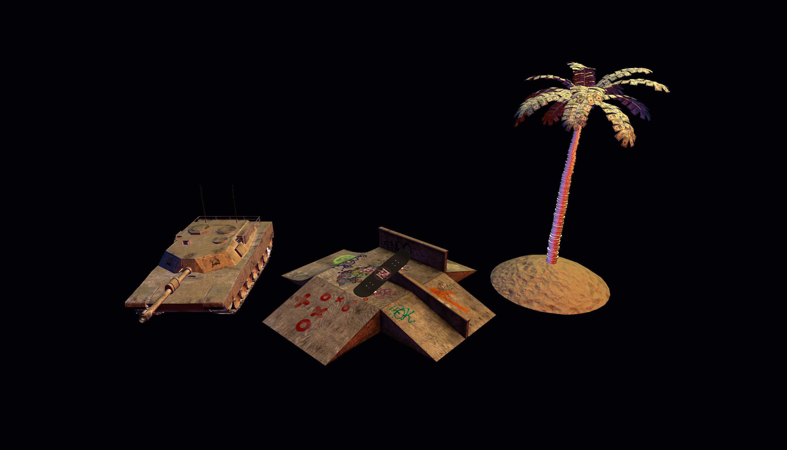
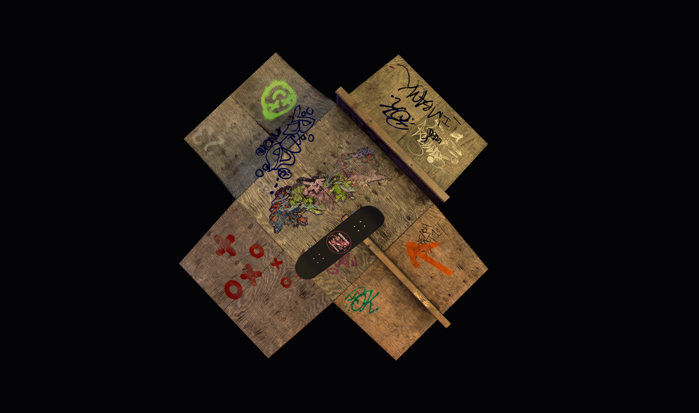
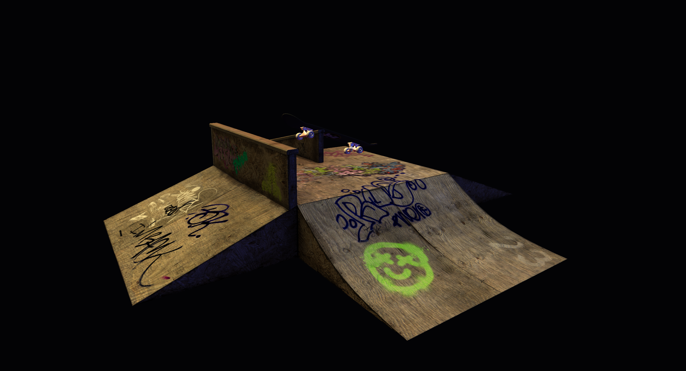

# CG PA3

## How to run

    make            # rock
    make art        # artistic scene

## Controls

| Key | Action |
|-----|--------|
| left drag                | orbit |
| middle/right drag        | pan |
| scroll                   | zoom |
| `R`                      | reset camera |
| `1`..`5`                 | force shading mode |
| `0`                      | reset shading mode |
| `Tab` / `Shift+Tab`      | cycle selected object |
| `h` / `l`                | translate selected X |
| `j` / `k`                | translate selected Y |
| `n` / `m`                | translate selected Z |
| `Shift+h..m`             | rotate around X/Y/Z |
| `-` / `=`                | scale down / up |
| `Enter`                  | save state to `scene.json` |
| `Esc`                    | quit |

Selected object is shown in the window title.

## Implementation notes

- Tangents computed at load.
- Smooth normals generated by face-normal averaging when the OBJ
  lacks `vn` records.
- Roughness → shininess: `n = 1 / (rough_a · r + rough_b)`. Defaults
  `rough_a = 200`, `rough_b = 0.05` give Phong exponents around 5–200.
- Lights: distance attenuation
  `1 / (1 + 0.05 d + 0.01 d²)`.
- Normal map: tangent-space sample is `texture · 2 − 1` projected
  through the per-fragment TBN frame.
- Mesh normalisation: positions recentered and scaled so the longest
  axis spans `[-1, 1]`, so any OBJ drops in at a sane size.
- `scene.json` file (per directory) contains the scene metadata and states.

## Screenshots

Basics: Wireframe

Step 1: Gouraud / Phong, no textures

Step 2: Phong + textures

Step 3: Normal mapping

Voting: Artistic scene: skatepark 

## References

Free models:

- [Funbox](https://www.turbosquid.com/FullPreview/991982)
- [Skateboard](https://www.turbosquid.com/FullPreview/2336586)
- [Tank](https://www.turbosquid.com/FullPreview/2519061)
- [Palm Tree](https://www.turbosquid.com/FullPreview/2396373)

