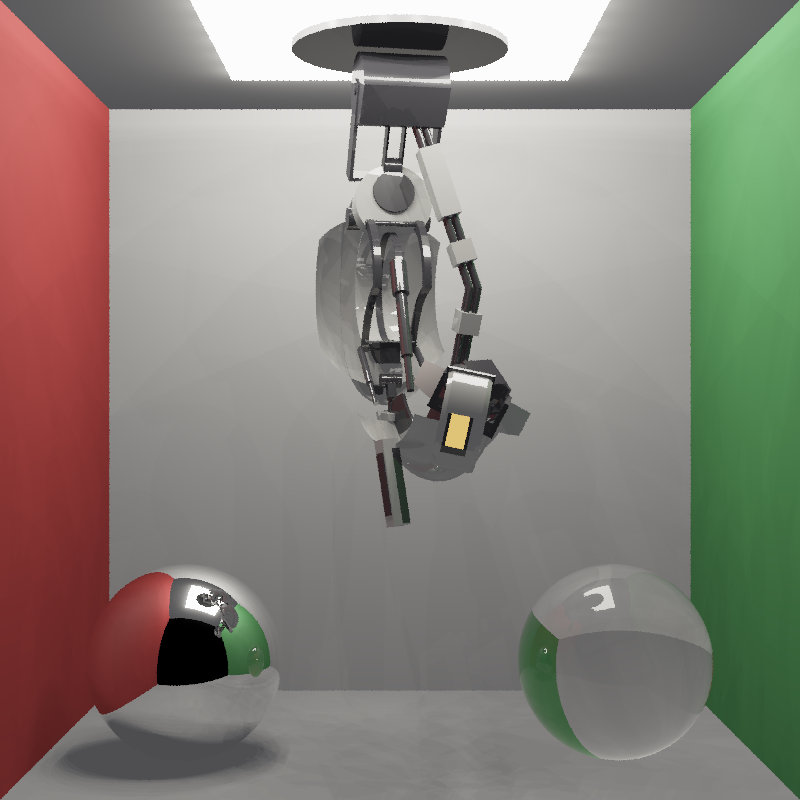
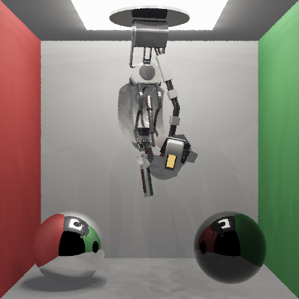
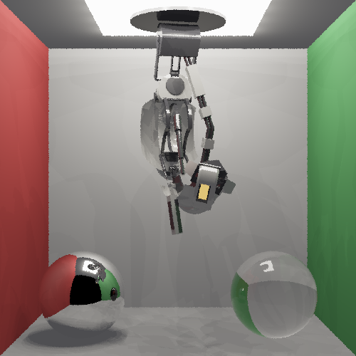
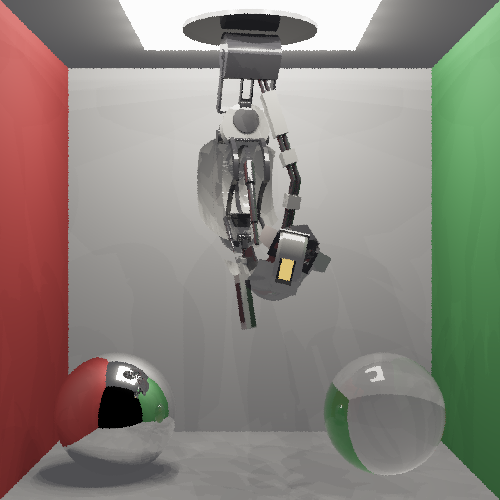
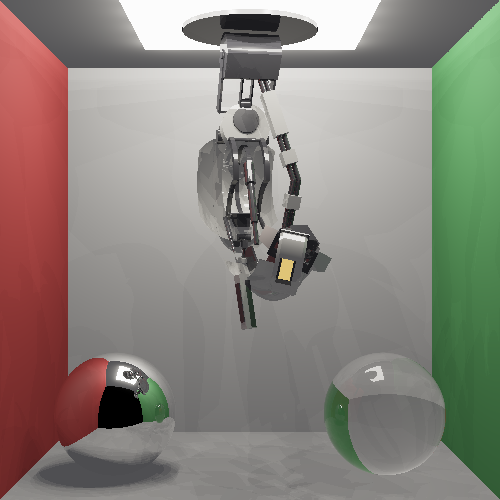
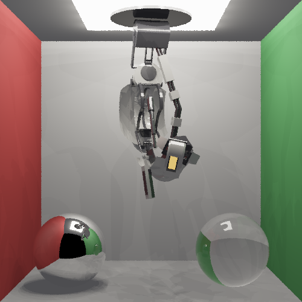
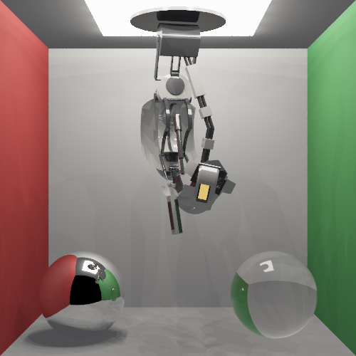
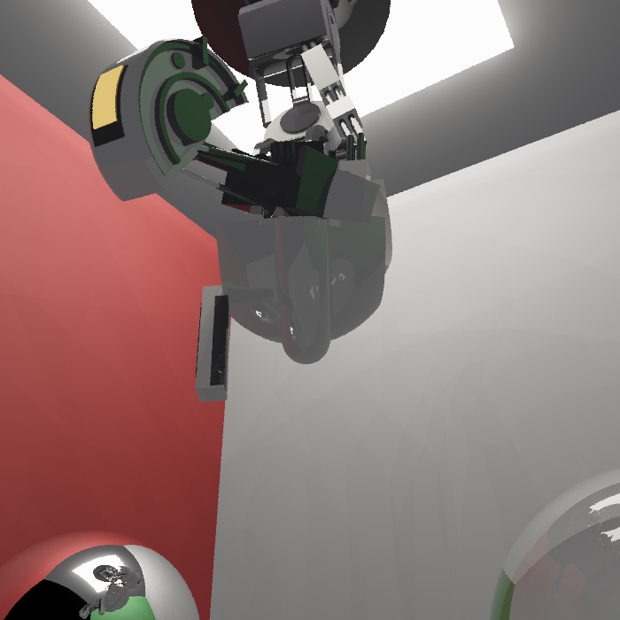
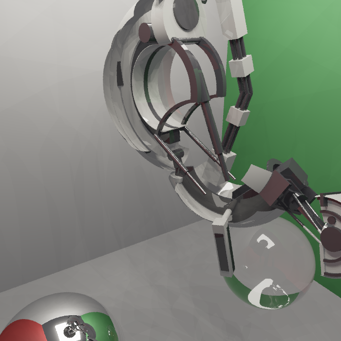

# PA4

A backward recursive ray tracer on the GPU using PyTorch. The
scene is a Cornell box containing *GlaDOS* (my PA1 procedural mesh model,
posed statically) hanging from the ceiling, with a mirror sphere and
a glass sphere on the floor.

## Implemented

- Shadows, reflection (mirror sphere), refraction (glass sphere, Schlick-Fresnel
  split), traced recursively to `--depth` bounces.
- Anti-aliasing by averaging `--spp` jittered rays per pixel.
- Primitives: triangle mesh, sphere, bounded plane. Blinn-Phong shading.
- Acceleration: a BVH over the model triangles, built on CPU and traversed on
  the GPU.
- Static posing pasted from the PA1 model.

## Run

```bash
make            # build .venv and render the GlaDOS image to render.png
make compare    # render comparison sets
make preview    # low-res preview
```

Or directly:

```bash
.venv/bin/python main.py --pose look --width 800 --height 800 --spp 4 --depth 4
```

Flags: `--width/--height`, `--spp`, `--depth`, `--light-grid N`,
`--pose`, `--exposure`, `--no-spheres`,
`--out`, `--compare-depth`, `--compare-spp`.

## Results

### Cornell box


`docs/vote_1.png` (800×800, spp 4, depth 4).

### Recursion depth

| depth 1 | depth 2 | depth 4 |
|---|---|---|
|  |  |  |
| `docs/compare_depth_1.png` | `docs/compare_depth_2.png` | `docs/compare_depth_4.png` |

At depth 1 the glass sphere is opaque black: the ray refracts in, hits the unlit
interior, and recursion stops before it can exit. Depth 2 lets it traverse both
interfaces, so the sphere turns transparent. Depth 4 adds the deeper bounces
(the mirror and glass spheres reflecting each other and the room).

### Rays per pixel
| spp 1 | spp 4 | spp 16 |
|---|---|---|
|  |  |  |
| `docs/compare_spp_1.png` | `docs/compare_spp_4.png` | `docs/compare_spp_16.png` |

The GlaDOS silhouette, thin wires, and sphere edges alias badly at spp 1. They
smooth out by spp 4 and are clean at spp 16.

### Voting
| | | |
|---|---|---|
|  |  |  |
| `docs/vote_1.png` | `docs/vote_2.png` | `docs/vote_3.png` |

## References

- T. Whitted. An Improved Illumination Model for Shaded Display. CACM 23(6),
  1980. https://dl.acm.org/doi/10.1145/358876.358882
- T. Möller, B. Trumbore. Fast, Minimum Storage Ray/Triangle Intersection.
  Journal of Graphics Tools 2(1), 1997.
  https://doi.org/10.1080/10867651.1997.10487468
- C. Schlick. An Inexpensive BRDF Model for Physically-based Rendering. Computer
  Graphics Forum 13(3), 1994.
  https://onlinelibrary.wiley.com/doi/10.1111/1467-8659.1330233
