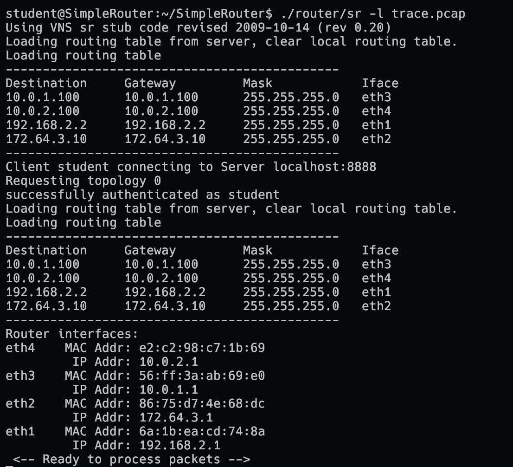
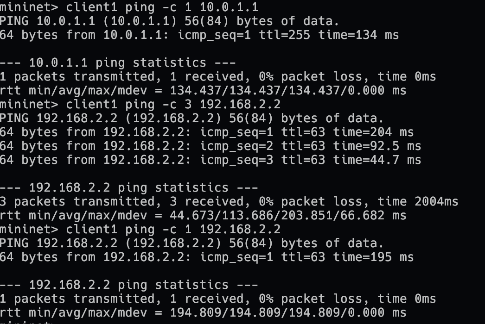
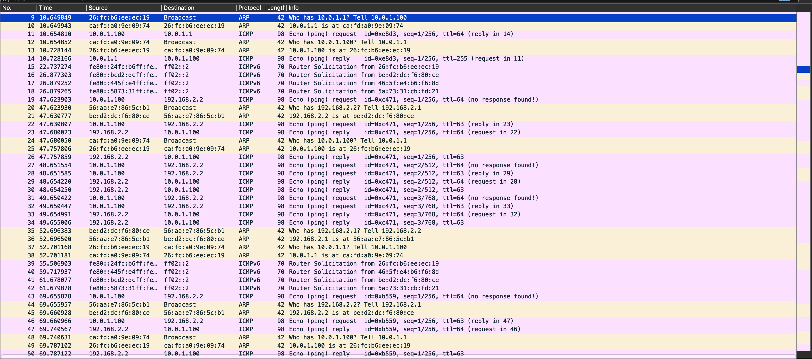
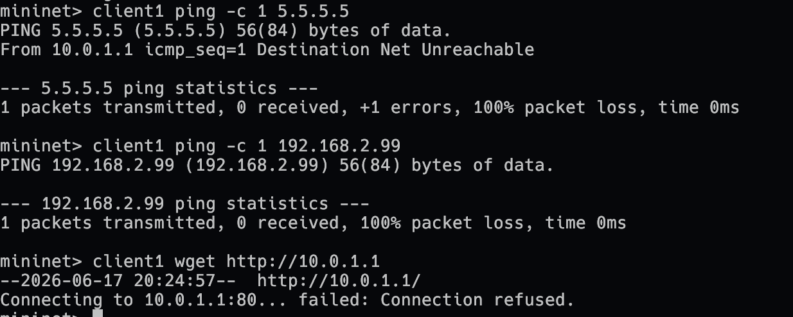
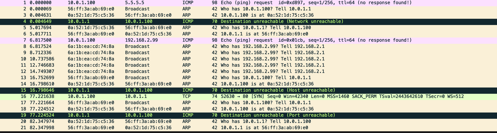
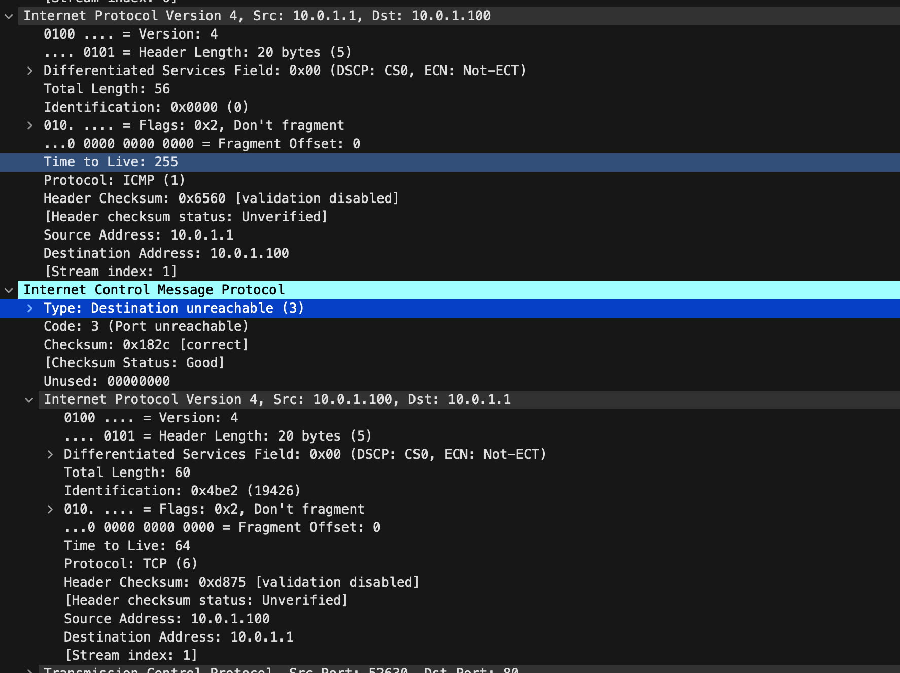
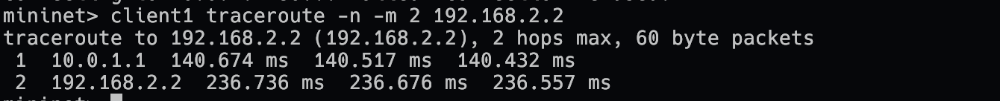
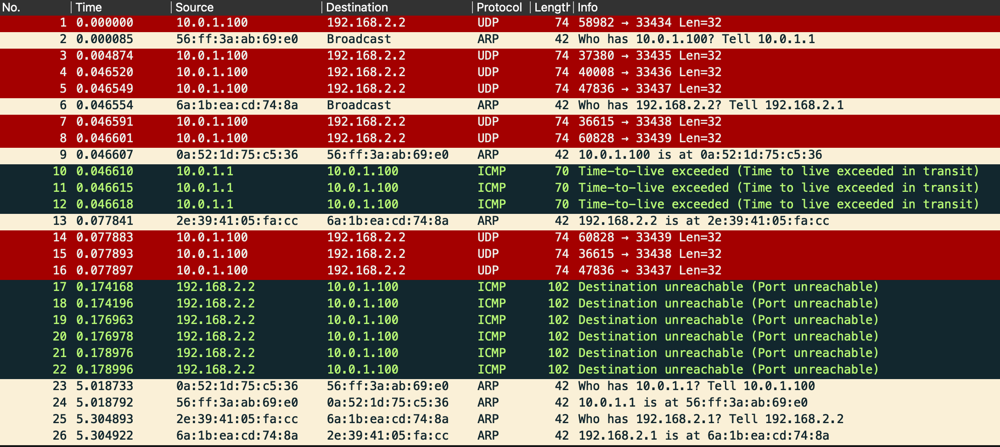
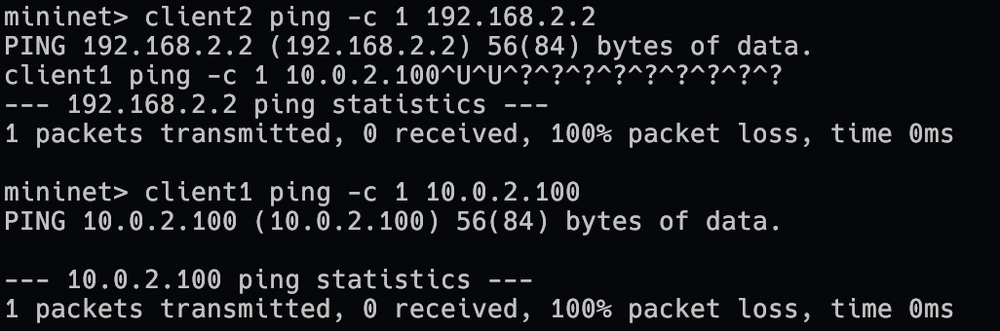
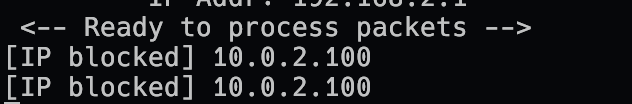

# 1. Setup



OVA: SimpleRouter_public (Ubuntu 22.04, x86_64).

# 2. Ping test

```
client1 ping -c 1 10.0.1.1
client1 ping -c 3 192.168.2.2
# wait > 15 s
client1 ping -c 1 192.168.2.2
```





- *Echo reply.* ICMP type 0 reply from 10.0.1.1 to the first ping.
- *ARP Broadcast.* The first forward triggers an ARP request to ff:ff:ff:ff:ff:ff.
- *ARP Reply unicast.* Server1 ARP reply unicast to the router's MAC.
- *ARP Cache.* ARP exchanges happen only during the first ping; the second and third pings carry no new ARP traffic.
- *IP Forwarding, TTL decrement.* Forwarded echo request keeps src/dst IP, TTL drops from 64 to 63.
- *ARP Evict.* After the 15 s timeout, the next single ping issues a fresh ARP.

# 3. Unreachables

```
client1 ping -c 1 5.5.5.5            # no route
client1 ping -c 1 192.168.2.99       # no host
client1 wget -t 1 -T 2 http://10.0.1.1  # TCP to router
```





- *Network unreachable.* 5.5.5.5 produces one ICMP type 3 code 0 from router.
- *Host unreachable.* 192.168.2.99 produces five ARP requests at 1 s intervals, then one ICMP type 3 code 1.
- *Port unreachable.* TCP to 10.0.1.1 produces one ICMP type 3 code 3 from router.

# 4. IP/ICMP packet



- *ICMP checksum correctness.* ICMP checksum shown as `[correct]`.
- *Initial maximum TTL.* Router-originated ICMP packets carry IP TTL = 255.

# 5. Traceroute

```
client1 traceroute -n -m 2 192.168.2.2
```





- *TTL exceeded.* TTL=1 probes get ICMP type 11 code 0, src 10.0.1.1.
- TTL=2 probes are forwarded with TTL=1; server1's port unreachable reply is forwarded back.

# 6. Firewall (10.0.2.0/24)

```
client2 ping -c 1 192.168.2.2    # inbound
client1 ping -c 1 10.0.2.100     # outbound
```





- *Firewall Inbound, Inbound log.* Packet from 10.0.2.100 is dropped; router prints `[IP blocked] 10.0.2.100`.
- *Firewall Outbound, Outbound log.* Packet to 10.0.2.100 is dropped with the same message.
