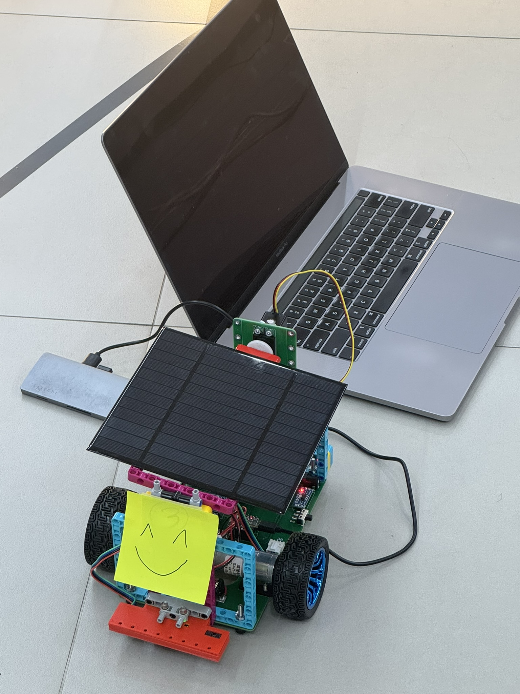

# Solar Gongisa

Solar-powered line-following RC car for the Solar AI Mobility Camp competition.



## Architecture

```
ESP32-C3 (board/)
  main.py               <- Competition code
  core/
    drv8833.py          <- DRV8833 dual motor driver
    mux04.py            <- MUX04 8-channel line sensor (I2C 0x12)
    ina226.py           <- INA226 current/voltage sensor (I2C 0x40, 0x41)
    myservo.py          <- Servo for solar panel angle

PC (scripts/)
    recv_telemetry.py   <- UDP text log receiver
    01-10_*.py          <- Test/development scripts
```

### Hardware

| Component       | Interface | Address/Pins         |
|-----------------|-----------|----------------------|
| ESP32-C3 Mini   | -         | Single-core RISC-V   |
| DRV8833         | PWM       | IN1=0, IN2=1, IN3=4, IN4=3 |
| MUX04           | I2C       | 0x12                 |
| INA226 (solar)  | I2C       | 0x40                 |
| INA226 (battery)| I2C       | 0x41                 |
| Servo           | PWM       | GPIO 10, 50Hz        |
| I2C bus         | -         | SDA=6, SCL=7         |

### Main Loop

Single cooperative loop, no threading.

```
while True:
    1. Read MUX04 + PD steering             every iteration (~10ms)
    2. Check charging trigger               every iteration
    3. Battery voltage + speed adaptation    every 1000ms
    4. WiFi check + UDP telemetry            every 500ms
```

### States

- **DRIVING**: Line following with PD controller, adaptive speed based on battery voltage.
- **CHARGING**: Stopped at horizontal line (all 8 sensors active). Finds best solar panel angle via servo sweep, charges for calculated duration, then drives forward to clear the line.

## Tunable Parameters

All constants are at the top of `board/main.py`.

### PD Line Following

| Parameter | Value | Description |
|-----------|-------|-------------|
| `KP`      | 1.2   | Proportional gain |
| `KD`      | 0.8   | Derivative gain. Damps oscillation on curves. |
| `WEIGHTS` | [-100, -30, -20, -10, 10, 20, 30, 100] | Per-channel sensor weights. Outer channels weighted heavily for early drift detection and sharp corners. |

Steering formula: `steering = (KP * error + KD * derivative) * scale`

Non-linear amplification for sharp turns: `scale = 1.0 + max(0, abs_err - 50) / 50.0`. Doubles steering when error exceeds 50.

### Speed & Motor

| Parameter       | Value | Description |
|-----------------|-------|-------------|
| `SPEED_HIGH`    | 100   | V > 3.3V |
| `SPEED_NORMAL`  | 100   | V > 3.0V |
| `SPEED_LOW`     | 100   | V > 2.8V |
| `SPEED_CRITICAL`| 75    | V <= 2.8V. Hardware limits make higher speeds ineffective at low voltage. |
| `MIN_SPEED`     | 45    | Motor dead zone. Below 45% PWM the motors don't spin. `drive()` enforces this. |

Speed transitions are smoothed: `base_speed += 0.3 * (target - base_speed)`.

### Battery Thresholds (under load)

| Parameter    | Value | Meaning |
|--------------|-------|---------|
| `V_NORMAL`   | 3.3V  | Full speed range |
| `V_LOW`      | 3.0V  | Normal operation |
| `V_CRITICAL` | 2.8V  | Speed drops dramatically below this due to hardware limits |

Observed: ~0.2-0.3V drain per lap, ~0.3V voltage rise when motor stops (no-load offset).

### Charging

Triggered when all 8 line sensors are active (horizontal line = charging station) AND battery voltage is below trigger.

| Parameter          | Value | Description |
|--------------------|-------|-------------|
| `V_CHARGE_TRIGGER` | 3.0V  | Start charging below this (under load) |
| `V_CHARGE_TARGET`  | 3.1V  | Charge target (under load equivalent) |
| `V_STOP_OFFSET`    | 0.3V  | Voltage rise when motor stops. Used to convert between under-load and no-load readings. |
| `CHARGE_MAX_SEC`   | 120   | Maximum charge duration |
| `CHARGE_MIN_SEC`   | 12    | Minimum charge duration |

Charge duration is calculated based on voltage gap and remaining competition time. No charging in the last 2 minutes. Duration scales down when 2-5 minutes remain.

Charging sequence: stop motor -> wait 300ms for voltage settle -> check if worthwhile -> servo sweep to find best solar angle (0-180 in 5-degree steps) -> charge until target or timeout -> drive forward 500ms to clear horizontal line.

### Solar Panel Servo

| Parameter              | Value | Description |
|------------------------|-------|-------------|
| `SERVO_SCAN_STEP`      | 5     | Degrees per step during angle sweep |
| `SERVO_SCAN_INTERVAL_MS`| 50   | Settle time per step |

Full sweep (0-180 in 5-degree steps): ~37 positions x 50ms = ~1.8s. Only runs during charging.

### Line-Loss Recovery

Three phases, never stops moving:

| Phase | Iterations | Action |
|-------|-----------|--------|
| Turn  | 0-50 (~500ms) | One-wheel drive in last-known-error direction |
| Pivot | 50-150 (~1s) | Spin in place to sweep sensor across line |
| Spin  | 150+ | Continue spinning until line found |

### Telemetry

WiFi connects asynchronously at startup (non-blocking). Telemetry is sent via UDP every 500ms once connected.

| Parameter | Value |
|-----------|-------|
| `SSID`    | Team 03 |
| `PC_IP`   | 192.168.137.1 |
| `PC_PORT` | 5005 |

## Quick Start

```bash
# Setup
source activate.sh

# Upload code to ESP32
sync

# Run any scripts
mp run scripts/01_motors.py

# Simple UDP log server (on PC)
python3 scripts/recv_telemetry.py
```

## Competition Strategy

1. Drive at full speed while battery is high. Charge at stations once voltage drops below 3.0V.
2. Three-phase recovery (turn, pivot, spin) always keeps the robot moving toward the line.
3. Charging rate (~0.06V/min) is much slower than drain rate (~0.2-0.3V/lap). Short top-ups to stay above 2.8V are more effective than long charging sessions.
4. Motor performance drops dramatically below 2.8V. All strategy revolves around staying above this threshold.

